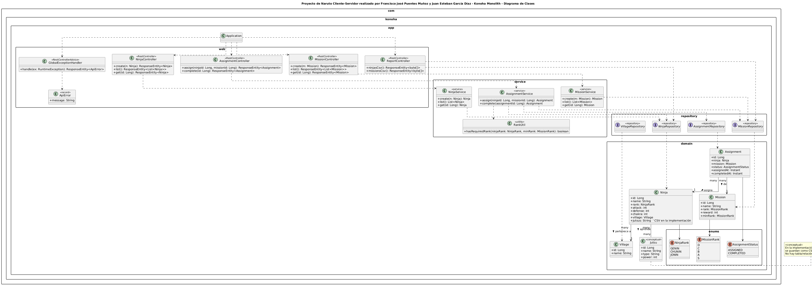

## Proyecto realizado por Francisco José Puentes Muñoz y Juan Esteban García Díaz para la clase de Arquitectura en Software

## 1. Ejecutar en Visual Studio Code
- => Run Java
## 2. Abrir en el navegador
http://localhost:8080/
```
> Nota: Se mapea el directorio `./data` para persistir el H2 en el host.

## Tecnologías
- Java 17
- Spring Boot 3 (Web, Data JPA, Validation)
- H2 (archivo) para persistencia
- OpenAPI/Swagger UI
- Cliente HTML/JS minimalista servido por Spring (mismo deploy)
- Docker (multi-stage build)

## Endpoints clave
- `GET /` — Cliente web
- `GET /swagger-ui.html` — Documentación interactiva
- `GET /h2-console` — Consola H2 (JDBC: `jdbc:h2:file:./data/konoha`)
- `POST /api/v1/ninjas` — Crear Ninja
- `GET /api/v1/ninjas` — Listar Ninjas
- `POST /api/v1/missions` — Crear Misión
- `GET /api/v1/missions` — Listar Misiones
- `POST /api/v1/assignments/assign?ninjaId=&missionId=` — Asignar misión a ninja (valida rango)
- `POST /api/v1/assignments/{id}/complete` — Marcar completada
- `GET /api/v1/reports/ninjas.csv` — Exportar CSV ninjas
- `GET /api/v1/reports/missions.csv` — Exportar CSV misiones

```
> Nota: Se mapea el directorio `./data` para persistir el H2 en el host.

## Modelo de datos (relacional)
- **Village** (id, name)
- **Ninja** (id, name, rank, attack, defense, chakra, village_id, jutsus)
- **Mission** (id, name, rank, reward, min_rank)
- **Assignment** (id, ninja_id, mission_id, status, assigned_at, completed_at)

## Semillas
En `src/main/resources/data.sql` se crean tres aldeas por defecto.

---

© 2025.


